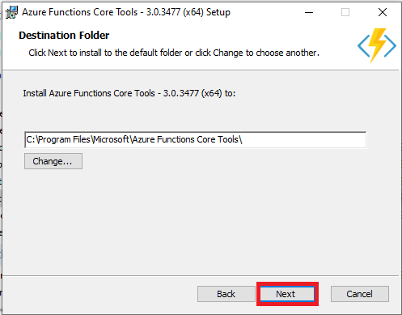
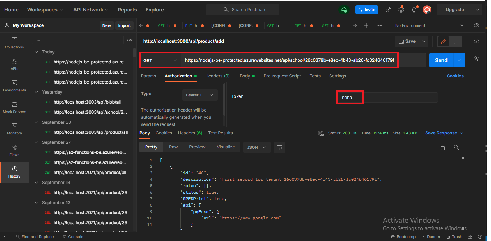

# Developing a Azure-Functions-Node.js app that communicates with COSMOS DB
Azure Functions is a serverless solution that allows you to write less code, maintain less infrastructure, and save on costs.The code included in this sample is intended to get you going with a simple **Azure function** that connects to **COSMOS DB** , **Blob Storage** and **ServiceBus**

## Prerequisites before you download any code

Before you can run this sample, you must have the following perquisites:
* Visual Studio Code ( Latest Version ) - If you don't have this editor, refer to the [Download Visual  Studio Code](https://code.visualstudio.com/download) link.
* [Node.js](https://nodejs.org/en/) version v14.15.4 or higher.
* [npm] (https://www.npmjs.com/package/download) version 6 and higher
* Azure CLI ( Select for your system ) (https://docs.microsoft.com/en-us/cli/azure/install-azure-cli)
* Azure Functions Core Tool ( V3.x ) ( Version is depends on your Node.js version) 
* Azure Function extension for visual studio code 
*  An active Azure Cosmos DB account - If you don't have an account, refer to the [Create an Azure Cosmos DB account](https://docs.microsoft.com/en-us/azure/cosmos-db/create-sql-api-nodejs#create-a-database-account) article.
* [Git](http://git-scm.com/).


## Create Cosmos DB

1. In Azure portal, search for and select **Azure Cosmos DB**.

2. On the Azure Cosmos DB page, select **Create**.

 
    &nbsp;
    Please select the SQL option here


3. In the Create Azure Cosmos DB Account page, fill out the Form inputs as follows:
- **Subscription** - Select your subscription.
- **Resource group** - Select your resource group  name. If you don't have, create new.
- **Account Name** - Enter unique Azure Cosmos account name.
- **API** - Select Core (SQL) to create a document database and query by using SQL syntax.
- **Location** - Select your nearest region.
- **Capacity mode** - Select Provisioned throughput to create an account in provisioned throughput mode. Select Serverless to create an account in serverless mode.
- **Apply Azure Cosmos DB free tier discount** - With Azure Cosmos DB free tier, you will get the first 1000 RU/s and 25 GB of storage for free in an account.

    
    &nbsp;

4. Select **Review + create**. 
 
    &nbsp;
    
5. Select **Create**
    
    &nbsp;

6. To create new **database** and **container**, select **Data Explorer** in your Azure Cosmos DB account and click on **New Container**. Fill out the Form inputs as follows:
        - **Database ID** - Enter **admin** as the name for the new database.
        - **Container ID** - Enter **mproducts** as the name for your new container.
        - **Partition key** - This code uses **/tenantId** as the partition key. 
 
7. Select **Go to resource** to go to the Azure Cosmos DB account page. Select **Keys** from the left navigation, and then select **Read-write Keys**.


&nbsp;

   Copy **Database ID** and **Container ID** into notepad. 
    In Azure portal from the **Data Explorer**, expand the **admin** database, expand the **mproducts** container. Select **Items**, and then select **New Item**. Now add a document to the container with the following structure
    
```bash
    [ add products list data]
```
  
  &nbsp;
  
7. Now you are ready with **Azure Cosmos DB account**.


  &nbsp;

Take the keys from here and save it in your notepad 


# How to run Azure Function locally first using Visual Studio Code

## Clone the repository

```bash
    git clone https://github.com/RobinGhosh64/az_functions_be.git
    cd az_functions_be
```
## Install Visual Studio. 
1. Use [Download Visual  Studio Code](https://code.visualstudio.com/download) link

2. Select for yuor system


 &nbsp;

## Install Azure CLI
1. Use [Download Azure CLI](https://docs.microsoft.com/en-us/cli/azure/install-azure-cli) link

2. Select for your system (here we select for window)


 &nbsp;

3. Select **Current release of the Azure CLI**


 &nbsp;

4. Go to downloads and click on downloaded **Azure-cli** 

5. Select **checkbox** and **Install**


 &nbsp;

6. Select **Finish**


 &nbsp;

7. Now you are successfully downloaded **Azure CLI**

## Install Azure Functions Core Tool
1. Use [Download Azure Functions Core Tool](https://docs.microsoft.com/en-us/azure/azure-functions/functions-run-local?tabs=v3%2Cwindows%2Ccsharp%2Cportal%2Cbash%2Ckeda#v2) link

2. Select for your system (here we select for window)


 &nbsp;

3. Go to downloads and click on downloaded **Azure Function Core Tool**. Select **Next**


 &nbsp;

4. Select **checkbox** and **Next**


 &nbsp;

5. Select **Next** OR you can change destination folder path


 &nbsp;

6. Select **Install**


 &nbsp;

7. Select **Finish**


 &nbsp;

8. Now you are successfully downloaded **Azure Function Core Tool**

## Azure Function extension for visual studio code 

1. Open **visual studio code** and **Click** on **Extension** options.


 &nbsp;

2. Search **Aure Functions** and **Click** on it. Then select **Install**.


 &nbsp;

3. Now you are successfully downloaded **Azure Functions Extension**

## Verify downloaded Tools

1. Run **az func init** in command prompt

2. Run **az start** in command prompt

## Code Details
1. Open **Azure function code** inside **Visual Studio Code**

2. Open **local.settings.json** file and fill it with your **COSMOS DB** and **local environment** details, which are you saved in notepad.

    ```bash
    WEBSITE_SLOT_NAME="~your Website slot name",
    FUNCTIONS_EXTENSION_VERSION="~your Function extention version",
    ScmType="~your Scm type",
    APPLICATIONINSIGHTS_CONNECTION_STRING="~your application Insights connection string",
    APPINSIGHTS_INSTRUMENTATIONKEY="~your application Insights instrumentation key",
    WEBSITE_NODE_DEFAULT_VERSION="~your Node default version",
    WEBSITE_CONTENTAZUREFILECONNECTIONSTRING="~your website content azure file connection string",
    WEBSITE_CONTENTSHARE="~your website content share",
    WEBSITE_AUTH_ENABLED="False",
    FUNCTIONS_WORKER_RUNTIME="~your function worker runtime",
    WEBSITE_SITE_NAME="~your website site name",
    AzureWebJobsStorage="~your AzureWebJobsStorage value",
    rghosh-cosmos-sql_DOCUMENTDB="~your COSMOS DB connections string",
    rsgservicebus_SERVICEBUS="~your service bus connection string" 
    ```
    
4. We are take look on one of the function. example: **FindProducts** In FindProducts folder open **function.json** file. Here we look **Azure Cosmos DB bindings**.

Binding to a function is a way of declaratively connecting another resource to the function; bindings may be connected as **input bindings, output bindings**, or both. Data from bindings is provided to the function as parameters.


 &nbsp;

5. The binding configuration properties that you set in the function.json file and the CosmosDB attribute.
- **type**: Must be set to **cosmosDB**.
- **direction**: Must be set to in.
- **name**: Name of the binding parameter that represents the document in the function.
- **databaseName**: The database containing the document.
- **collectionName**: The name of the collection that contains the document.
- **connectionStringSetting**: The name of the app setting containing your Azure Cosmos DB connection string.
- **sqlQuery**: An Azure Cosmos DB SQL query used for retrieving multiple documents. The property supports runtime bindings

6. Open **index.js** file. Here's the JavaScript code.


 &nbsp;

You can see the name of the binding parameter i.e. **ourproducts** that binds inputData

7. If you are set all the bindings in each function then, Run `npm install` in a terminal to install required npm modules.

8. Run `func host start` in a terminal to start your node application. **OR** You can debug it. Select **Run** and click on **Start Debugging**.  Navigate to `http://localhost:7071/`. 


 &nbsp;

If you are got all api's endpoints in terminal, you are successfully run this application locally. CONGRATULATIONS. 


 &nbsp;


# How to test routes of this application locally

1. Have you completed all the settings required for this applications? Then we are good to test the routes of this application.

## To check Azure COSMOS DB endpoint
In postman put the url `http://localhost:7071/api/product/all` , use GET methode. 
 

&nbsp;

For all this routes, If you get `200 ok` status, then you are good. 

CONGRATULATIONS, you have now tested this application locally. 

# Add Local project into your own GitHub Account
Please make sure you clone this project into your own project under your own GitHub Account


&nbsp;

# Deploying this project into Azure

1. In the Azure Portal, search for Function App.

2. Create a new Function App


&nbsp;

3. Fill out the Form inputs as follows:
- **Subscription** - Select your subscription
- **Resource group** - Select your resource group  name. If you don't have, create new.
- **Name** - Enter unique App Service name.
- **Publish** - Select **Code**.
- **Runtime stack** - Select **Node 14 LTS**.
- **Operating system** - Select windows as operating system.
- **Region** - Select your nearest region.

4. Click on **Review + create** button. This will go to validation screen


&nbsp;

5. Click on **Create** button, if you think everything is ok otherwise you can go back. This will start the resource creation.


&nbsp;

6. Once done Click on **Go to resource** button.


&nbsp;

7. Click on **URL** of the newly created Web App on the top right side. This should take you to a Hello Function App Developer page. This is a blank sample app.


&nbsp;

8. Click on **Deployment** button, to now start deploying your code.


&nbsp;

9. Click on **Github** option from the dropdown. If you have code parked at other SCM, please override with those settings


&nbsp;

10. Fill out the Form inputs as follows:
- **Authenticate** - with GitHub
- **Organization** - Select your organization
- **Repository** - Select your repository
- **Branch** - Select your branch
- **Preview File** - Select **Preview File**


11. Click on **Save** button uptop. This will start the deployment from your GitHub repository into this newly created Web App. You will be on the **Logs** tab


&nbsp;

12. Click on or your deployment. Click on **commit id** link to see your deployment details


&nbsp;

13. Please make sure it says 'Deployment successful' in the final messages. Click on **Close** button

# Configure Application settings by injecting values straight from the portal

1. Click on **Configuration** tab from the left blade. 


&nbsp;

2. Click on **New Application setting** link. Add a new setting and the required value (key pair style)


&nbsp;

3. Click on **Ok** button, to save. You can keep on doing this until you have finished entering all the required settings for this app

4. Once finished with all settings, Please make sure you click on **Save** button on the top. At this point, click on **Continue** Azure will restart the application and your application will inherit those settings once it comes back up.


&nbsp;


# Test this application to verify it is running on Azure
   In Azure portal select your newly created **App service**. Copy the **URL**. Use this **URL** to verify the application is running on Azure.
   We will need this URL to test out with Postman

## Step 1 - To check Azure SQL database endpoint
In postman put the url `https://nodejs-be-protected.azurewebsites.net/api/product/all` , use GET methode and set Bearer Token. 
 

&nbsp;

## Step 2 - To check Azure COSMOS DB endpoint
In postman put the url `https://nodejs-be-protected.azurewebsites.net/api/school/26c0378b-e8ec-4b43-ab26-fc024646179f` , use GET methode and set Bearer Token. 
 

&nbsp;

## Step 3 - To checkAzure Storage account endpoint
In postman put the url `https://nodejs-be-protected.azurewebsites.net/api/blob/all` , use GET methode and set Bearer Token. 
 

&nbsp;

Make sure you see a 200 status and list of json objects

Congratulations, you have successfully deployed this application on Azure and made sure it is fully functional

##

Remember, this is a back-end REST-API project. To see this project being consumed by another client, please refer to the UI project
That way we can demonstrate a complete web application flow using Angular 11. The solution is available at  https://github.com/RobinGhosh64/angui-2-nodejs.git 

The UI authenticates with Azure AD, gets a valid JWT token and calls this back-end service with that token. Each button from the UI will exercise calls to this back end service.
From the UI:
1. Product button - Communicates with Azure SQL DB.

2. File button - Communicates with Azure blob storage.

3. School button - Communicates with Azure Cosmos DB.

Hope you all enjoyed working with this project and able to go deep into Azure. Feel free to put comments to Robin.Ghosh@microsoft.com 

